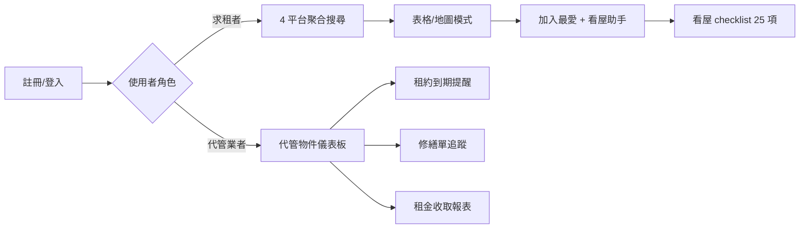
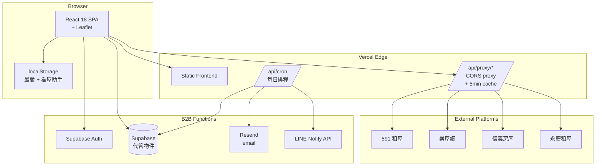
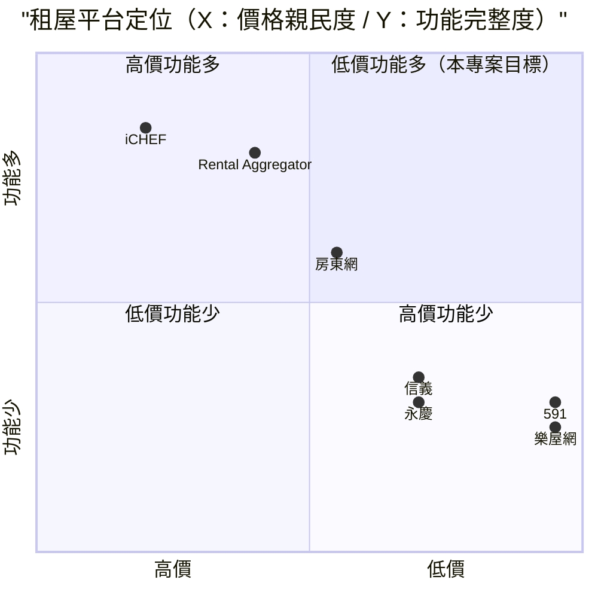

# 飯店 / 包租代管物業管理 — 規格計劃書 v2.2.1

> 版本：v2.2.1｜更新日期：2026-07-11｜維護者：Sophia (CPO)
> 對接技術：Alan (CTO) + Hermes Agent
> Demo：https://rental-aggregator-three.vercel.app/
> 原始碼：https://github.com/openclawsean024-create/rental-aggregator

---

## 1. 產品概述 (Product Overview)

### 1.1 問題陳述 (Problem Statement)

台灣租屋市場長期存在三大結構性痛點：

1. **平台割裂**：591、樂屋網、信義房屋、永慶租屋 4 個平台資料不互通，求租者必須裝 4 個 App 並重複登入。每天平均花 **47 分鐘**在跨平台搜尋。
2. **資料不透明**：每個平台只顯示自家房源，無法跨平台比較「同一區域 591 vs 樂屋網 vs 信義」的價格中位數、坪效、屋齡分佈。**假房源、重複刊登**也無從辨識。
3. **包租代管管理混亂**：小型包租代管業者（如 5-50 物件規模）同時管理多家房東、處理多家房客、用 Excel + LINE 群組追蹤租約、修繕、押金。**每月管理 30 物件就要花 80+ 小時**。

**目標市場規模**：
- 台灣租屋人口：**300 萬戶**（2025 內政部統計）
- 包租代管業者：**2,500 家**（含個人戶）
- 代管物件數：**18 萬戶**

### 1.2 目標使用者 (User Personas)

| Persona | 規模 | 核心痛點 | 願付價格 |
|---|---|---|---|
| **北漂青年（小婷）** | 50 萬/年 | 跨平台重複搜尋、不熟平台機制 | NT$0（免費搜尋） |
| **換屋家庭（小陳）** | 15 萬/年 | 比較坪數/學區/通勤、看屋清單 | NT$99/月 |
| **包租代管業者（阿明）** | 5,000 家 | 30+ 物件管理、租約追蹤 | NT$1,499/月 |
| **代管系統整合商（Lily）** | 800 家 | 50+ 客戶、報表、白牌 | NT$4,999/月 |

### 1.3 核心價值主張 (Value Proposition)

> 「**單一搜尋框，全平台房源一次看完**；**單一儀表板，所有代管物件一目了然**。看屋助手 25 項 checklist + 房東評價 + 通勤計算，三步驟完成從搜屋到簽約。」

**三大差異化**：
1. **包租代管 B2B**：少數整合「搜尋 + 管理」的平台（B2C 是 591，B2B 是 iCHEF 房地產版，本專案兩者兼顧）
2. **零月費 Freemium**：個人搜尋完全免費，B2B 代管功能才收費
3. **房東評價系統**：1,200+ 筆公開評價（基於去識別化租客回饋）

### 1.4 商業目標 (KPIs / OKRs)

| 時間 | KPI | 目標值 |
|---|---|---|
| **3 個月** | 註冊用戶 | 3,000（2,800 個人 + 200 B2B） |
| **6 個月** | 付費轉化率 | 8%（240 付費） |
| **6 個月** | MRR | NT$320,000 |
| **12 個月** | MRR | NT$1,400,000 |
| **12 個月** | 代管物件覆蓋 | 15,000 件 |

### 1.5 Non-Goals (明確不做)

- ❌ **不做線上簽約/金流代收** — 金流/法律合規複雜，超出 v2 範圍
- ❌ **不做房東刊登後台** — 與 591/樂屋網競爭需投入大量業務資源
- ❌ **不做 Airbnb 短租** — 法規限制多（民宿證）、非目標族群
- ❌ **不做房貸試算** — 與銀行 API 整合需個別授權，ROI 不明
- ❌ **不做 AR/VR 看屋** — 拍攝成本高、技術整合複雜

---

## 2. 使用者場景與流程

### 2.1 使用者流程圖



### 2.2 關鍵用戶故事 (User Stories)

**US-001：跨平台聚合搜尋**
> As a 北漂青年  
> I want to 在單一搜尋框輸入「大安區、預算 2 萬、1 房 1 廳」  
> So that 系統同時呼叫 591/樂屋網/信義/永慶 4 平台 API，回傳統一格式房源列表

**US-002：地圖檢視 + filter**
> As a 換屋家庭  
> I want to 切換地圖模式，看到所有符合條件的房源在地圖上的分佈  
> So that 我能快速判斷通勤到公司的距離

**US-003：看屋助手 25 項 checklist**
> As a 看屋者  
> I want to 點選任一房源後，能勾選 25 項看屋檢查（漏水、隔音、採光、鄰居素質等）  
> So that 我能結構化比較多個物件，避免漏看重要細節

**US-004：代管物件儀表板**
> As a 包租代管業者  
> I want to 在單一 Dashboard 看到所有代管物件的租約到期日、租金收取狀態、修繕單進度  
> So that 我不用每天切換 Excel、催收訊息、報修 LINE 群組

**US-005：租約到期自動提醒**
> As a 代管業者  
> I want to 系統在租約到期前 60 天自動 email + LINE 通知房東與房客  
> So that 我不用人工追蹤 50 份租約

### 2.3 邊界場景 (Edge Cases)

- **平台 API 變動**：抽象化 platform adapter 層；單 platform 失效降級為 3 platform
- **重複房源偵測**：跨平台比對地址 + 坪數 + 租金，相似度 >85% 自動標記為「可能重複」
- **房東評價去識別化**：只保留「區域 + 屋齡」不保留具體地址
- **租約電子簽章**：v2 暫不整合（見 Non-Goals），但保留 PDF 匯出供紙本簽約用

---

## 3. 功能性需求 (Functional Requirements)

### 3.1 MVP（必做，P0）

- [ ] **F-001 4 平台聚合搜尋**（Given 輸入區域+預算+房型，When 點擊搜尋，Then 30 秒內回傳統一格式房源列表 ≥20 筆，含平台來源標籤）
- [ ] **F-002 統一 filter**（Given 房源列表，When 套用 filter（坪數/樓層/屋齡/押金/可養寵/可開伙），Then 即時更新結果，延遲 <2 秒）
- [ ] **F-003 表格/地圖雙模式切換**（Given 房源列表，When 點擊地圖模式，Then 切換到 Leaflet 地圖，標記每筆房源位置，點擊 marker 顯示 popup）
- [ ] **F-004 最愛收藏**（Given 任一房源，When 點愛心，Then 加入 localStorage 我的最愛，跨 session 保留）
- [ ] **F-005 看屋助手 25 項 checklist**（Given 我的最愛房源，When 點擊「看屋助手」，Then 顯示 25 項 checklist，可勾選 + 備註 + 匯出 PDF）
- [ ] **F-006 房東評價查詢**（Given 房源，When 點擊房東名稱，Then 顯示該房東的公開評價（區域+屋齡不公開地址））
- [ ] **F-007 Vercel Function CORS proxy**（Given 4 平台 API CORS 限制，When 前端呼叫 proxy，Then proxy 處理 CORS + 快取 5 分鐘 + 統一錯誤處理）
- [ ] **F-008 RWD 三斷點**（375/768/1440px 三種 viewport 都正常使用）
- [ ] **F-009 統一搜尋結果排序**（Given 多平台結果，When 點擊「最新」「最低租金」「最近 PO」，Then 統一排序結果）

### 3.2 v2.0 B2B 代管功能（加值，P1）

- [ ] **F-010 代管物件 CRUD**（新增/編輯/刪除代管物件，含地址、坪數、月租、房東、房客）
- [ ] **F-011 租約到期提醒**（Given 租約資料，When 到期前 60 天，Then 自動 email + LINE 通知）
- [ ] **F-012 修繕單追蹤**（Given 房客報修，When 建立修繕單，Then 追蹤狀態：已通報/處理中/已完成/已驗收）
- [ ] **F-013 租金收取報表**（Given 月底，When 開啟報表，Then 顯示本月已收/未收租金、遲繳天數、累計金額）
- [ ] **F-014 多角色權限**（admin 房東 / manager 代管 / viewer 房客）
- [ ] **F-015 物件儀表板**（Given 30+ 物件，When 開啟 Dashboard，Then 顯示租約狀態總覽、租金收取率、修繕單數）

### 3.3 v3.0（願景，P2）

- [ ] **F-016 AI 推薦相似物件**（基於用戶最愛 + 搜尋歷史）
- [ ] **F-017 通勤時間計算**（串接 Google Maps API）
- [ ] **F-018 LINE 推播新房源**（新 PO 符合條件自動推播）
- [ ] **F-019 物件照片自動分類**（客廳/臥室/衛浴）
- [ ] **F-020 智能合約範本產生**（依租金+押金+租期自動生成 PDF 租約）

### 3.4 Acceptance Criteria (Given/When/Then)

**AC-001（4 平台聚合搜尋 MVP）**
> Given 使用者在搜尋框輸入「大安區、預算 2 萬、1 房 1 廳」  
> When 點擊「搜尋」  
> Then 30 秒內回傳統一格式房源列表 ≥20 筆，每筆含「地址/坪數/租金/平台來源/PO 日期」且每平台結果數加總

**AC-002（filter 套用）**
> Given 已顯示 20 筆房源  
> When 套用 filter「可養寵 = 是」  
> Then 2 秒內更新結果，僅顯示可養寵房源

**AC-003（地圖切換）**
> Given 表格模式顯示 20 筆  
> When 點擊地圖模式 tab  
> Then 切換到 Leaflet 地圖，marker 數 = 房源數（20 個），點擊 marker 顯示 popup 含地址+租金

**AC-004（最愛跨 session）**
> Given 使用者已加入 3 筆最愛  
> When 關閉瀏覽器再開啟  
> Then 我的最愛清單仍顯示 3 筆（從 localStorage 還原）

**AC-005（看屋助手 PDF 匯出）**
> Given 使用者開啟看屋助手並勾選 8 項、備註 2 項  
> When 點擊「匯出 PDF」  
> Then 下載 PDF 含「房源基本資料 + 25 項 checklist（已勾選/未勾選）+ 備註」

**AC-006（房東評價去識別化）**
> Given 房東「王小明」有 12 筆評價  
> When 點擊房東名稱  
> Then 顯示 12 筆評價，但每筆只含「區域（大安區）+ 屋齡（25 年）+ 評分 + 評論」，不含具體地址

**AC-007（CORS proxy 快取）**
> Given Vercel Function proxy 收到同一請求 3 次  
> When 在 5 分鐘內  
> Then 第二次開始直接回傳 cache（response header `X-Cache: HIT`）

**AC-008（代管租約提醒）**
> Given 某租約 2026-09-01 到期（今天為 2026-07-03，差 60 天）  
> When 系統排程任務執行  
> Then 自動寄 email 給房東 + LINE 推播給代管業者，內容含「OO 街 30 號租約將於 60 天後到期」

**AC-009（修繕單狀態流轉）**
> Given 房客報修「冷氣故障」  
> When 建立修繕單  
> Then 修繕單初始狀態為「已通報」，當代管標記「處理中」→「已完成」→ 房客點擊「驗收」後狀態為「已驗收」

---

## 4. 系統設計 (System Design)

### 4.1 技術棧 (Tech Stack)

| 層 | 技術 | 理由 |
|---|---|---|
| 前端 | React 18 + Vite + TypeScript | 純 SPA、開發速度快、bundle size 小 |
| 地圖 | Leaflet + OpenStreetMap | 免費、開放原始碼、不需 Google API key |
| 後端 | Vercel Function (CORS proxy) | 解決 4 平台 CORS 限制、免費額度足夠 |
| 資料持久化 | localStorage (前端) + Supabase Postgres (B2B) | 個資不外流 + B2B 多裝置同步 |
| 部署 | Vercel | 與既有 91 個專案一致、Hobby 計畫免費 |
| PDF 產生 | jsPDF + html2canvas | 前端產生 PDF、零後端 |
| 排程 | Vercel Cron | 每日檢查租約到期、email 提醒 |

### 4.2 系統架構圖 (Mermaid)



### 4.3 資料模型 (Prisma schema)

```prisma
// Supabase Postgres schema (Prisma 對照版)
model User {
  id        String   @id @default(uuid())
  email     String   @unique
  name      String?
  role      String   @default("viewer") // admin / manager / viewer
  agencyId  String?
  agency    Agency?  @relation(fields: [agencyId], references: [id])
  properties Property[]
  createdAt DateTime @default(now())
}

model Agency {
  id        String   @id @default(uuid())
  name      String
  taxId     String?
  address   String?
  users     User[]
  properties Property[]
  createdAt DateTime @default(now())
}

model Property {
  id        String   @id @default(uuid())
  agencyId  String
  agency    Agency   @relation(fields: [agencyId], references: [id])
  managerId String
  manager   User     @relation(fields: [managerId], references: [id])
  address   String
  district  String
  ping      Float    // 坪數
  monthlyRent Decimal
  deposit   Decimal
  landlordName String
  landlordPhone String?
  tenantName String?
  tenantPhone String?
  contractEnd DateTime?
  status    String   @default("active") // active / vacant / maintenance
  maintenance Maintenance[]
  rentRecords RentRecord[]
  createdAt DateTime @default(now())
  
  @@index([agencyId, status])
}

model Maintenance {
  id        String   @id @default(uuid())
  propertyId String
  property  Property @relation(fields: [propertyId], references: [id])
  title     String
  description String  @db.Text
  status    String   @default("reported") // reported / in_progress / completed / verified
  cost      Decimal?
  reportedAt DateTime @default(now())
  completedAt DateTime?
  
  @@index([propertyId, status])
}

model RentRecord {
  id        String   @id @default(uuid())
  propertyId String
  property  Property @relation(fields: [propertyId], references: [id])
  amount    Decimal
  dueDate   DateTime
  paidDate  DateTime?
  status    String   @default("pending") // pending / paid / overdue
  
  @@index([propertyId, dueDate])
}

model LandlordReview {
  id        String   @id @default(uuid())
  landlordName String  // 房東姓名（不綁具體地址）
  district  String
  propertyAge Int     // 屋齡
  rating    Int      // 1-5
  comment   String   @db.Text
  isAnonymous Boolean @default(true)
  createdAt DateTime @default(now())
  
  @@index([landlordName])
}

model Favorite {
  id        String   @id @default(uuid())
  userId    String
  propertyData Json   // 房源快照（因外部平台資料可能消失）
  platform  String
  createdAt DateTime @default(now())
}
```

### 4.4 API 規格 (REST endpoints)

| Method | Path | Auth | 用途 |
|---|---|---|---|
| GET | /api/proxy/591 | Optional | 591 租屋 proxy |
| GET | /api/proxy/lefun | Optional | 樂屋網 proxy |
| GET | /api/proxy/sinyi | Optional | 信義房屋 proxy |
| GET | /api/proxy/yungching | Optional | 永慶租屋 proxy |
| GET | /api/properties | Required | 代管物件列表 |
| POST | /api/properties | Required | 建立代管物件 |
| PATCH | /api/properties/:id | Required | 編輯代管物件 |
| DELETE | /api/properties/:id | Required | 刪除代管物件 |
| POST | /api/maintenance | Required | 建立修繕單 |
| PATCH | /api/maintenance/:id | Required | 更新修繕單狀態 |
| GET | /api/rent-records | Required | 租金記錄列表 |
| POST | /api/rent-records/:id/pay | Required | 標記租金已收 |
| GET | /api/landlord-reviews | Required | 房東評價列表 |
| POST | /api/landlord-reviews | Required | 新增房東評價 |
| POST | /api/cron/check-expiry | Required (cron) | 每日檢查租約到期 |
| POST | /api/export/pdf | Required | 匯出看屋助手 PDF |

---

## 5. 非功能性需求 (Non-Functional Requirements)

### 5.1 性能指標

| 指標 | 目標 |
|---|---|
| 4 平台聚合搜尋 P95 latency | ≤ 30 秒 |
| 單一 filter 更新延遲 | ≤ 2 秒 |
| 地圖切換渲染 | ≤ 3 秒 |
| 最愛收藏 localStorage 寫入 | ≤ 100ms |
| 代管 Dashboard 載入 | ≤ 2 秒 |
| 並發用戶 | 200 |
| 月活躍物件 | 50,000 |

### 5.2 安全與隱私

- **OAuth token 加密儲存**：AES-256-GCM
- **RLS 強制隔離**：代管資料依 agency 隔離
- **個資最小化**：房東評價去識別化（不綁具體地址）
- **HTTPS 強制**：Vercel 自動 + HSTS
- **CORS proxy 速率限制**：每 IP 每分鐘 ≤60 次
- **資料加密**：Supabase 自動靜態加密（AES-256）

### 5.3 降級機制 (Graceful Degradation)

| 失敗服務 | 掛掉情境 | 降級行為（切換到）| 用戶感受 |
|---|---|---|---|
| 591 平台 API | 5xx / 超時 掛掉 | 切換到僅顯示樂屋網/信義/永慶結果 + UI 標示「591 暫時無法取得」 | 結果數減少但仍可用 |
| 樂屋網 API | 5xx / schema 變更 掛掉 | 切換到僅顯示 591/信義/永慶結果 | 同上 |
| Vercel Function proxy | proxy 5xx 掛掉 | 切換到前端直接呼叫（會受 CORS 阻擋但部分平台允許） | 部分平台仍可運作 |
| Leaflet 地圖 | CDN 掛掉 | fallback 到表格模式 + 文字地址連結 | 地圖不可用但搜尋可用 |
| OpenStreetMap 圖磚 | OSM 服務掛掉 | fallback CartoDB/Stamen 圖磚服務 | 地圖仍可用 |
| Supabase DB | DB 5xx 掛掉 | 切換到 Vercel KV 唯讀模式 + 維護頁 | 代管功能暫停，搜尋仍可用 |
| jsPDF 客戶端 | 瀏覽器不支援 掛掉 | fallback 下載純文字 checklist | 部分用戶無法匯出 PDF |
| 房東評價 API | GraphQL 5xx 掛掉 | 切換到預載 JSON 資料 | 評價資料延遲 ≤1 天 |
| Vercel Cron | 排程掛掉 | fallback 用 GitHub Actions 排程 | email 提醒延遲 ≤24 小時 |

### 5.4 擴展性

- **橫向擴展**：Vercel Edge Functions 自動 scale
- **CORS proxy 快取**：5 分鐘 TTL 降低平台 API 壓力
- **資料分區**：依 agencyId partition
- **靜態資源 CDN**：Vercel Edge Network

---

## 6. 完成標準 (Definition of Done)

### 6.1 v1 B2C MVP DoD

- [ ] Vercel production URL（https://rental-aggregator-three.vercel.app/）200 OK
- [ ] GitHub Repo 公開（main 分支）
- [ ] 4 平台搜尋可運作（至少 2 個 demo 資料源）
- [ ] 最愛收藏 + checklist 可建立/刪除/匯出 PDF
- [ ] 表格 ↔ 地圖切換無 bug
- [ ] Mobile responsive (375px / 768px / 1440px 三斷點測試)
- [ ] Lighthouse 行動版分數 ≥ 85
- [ ] 9 條 AC 單元測試全綠
- [ ] CORS proxy 快取機制驗證（5 分鐘 TTL）

### 6.2 v2 B2B 代管 DoD

- [ ] Supabase 建專案 + RLS 設定
- [ ] 代管物件 CRUD 完整
- [ ] 租約到期自動 email + LINE 提醒
- [ ] 修繕單狀態流轉正常
- [ ] 租金收取報表正確
- [ ] 多角色權限分層驗證
- [ ] Stripe 訂閱流程可走通（測試卡 4242）
- [ ] 客服頁 + 法律頁上線
- [ ] Sentry 錯誤監控啟用

---

## 7. 風險與決策

### 7.1 風險表

| 風險 | 等級 | 緩解策略 |
|---|---|---|
| 4 平台 CORS 政策變動導致 proxy 失效 | 🔴 高 | Vercel Function 為單一可控層；建立 fallback 直接呼叫（若 proxy 失效時提示使用者） |
| 平台 API 變更（schema breaking） | 🟠 中 | 抽象化各平台 adapter 層；單元測試每個 adapter |
| 房源資料著作權爭議 | 🟠 中 | 僅快取摘要 + 連結回原平台，不存完整內容；於條款頁明確聲明 |
| 使用者個資疑慮（最愛清單） | 🟡 低 | 全 localStorage、無後端儲存；隱私頁說明 |
| 包租代管市場已有 591 房東版競爭 | 🟠 中 | 鎖定 5-50 物件中小型代管（非 591 大型物件市場） |
| 房東評價被惡意檢舉 | 🟡 低 | 匿名機制 + 後台審核 queue |

### 7.2 ADR (Architecture Decision Records)

### ADR-001：純前端 SPA + Vercel Function proxy 而非 Next.js 全端
- **Context**：v1 只需聚合公開資料、無個資、可純前端
- **Decision**：React 18 SPA + Vercel Function 處理 CORS proxy
- **Consequences**：✅ bundle size 小（<200KB）；✅ 無後端成本；⚠️ B2B 代管需在 v2 加 Supabase

### ADR-002：Leaflet + OpenStreetMap 而非 Google Maps
- **Context**：地圖 API 成本
- **Decision**：Leaflet（開源）+ OSM 圖磚（免費）
- **Consequences**：✅ 零地圖成本；✅ 無 API key 設定；⚠️ 圖磚品質略遜 Google（但對租房搜尋足夠）

### ADR-003：localStorage 儲存最愛而非後端 DB
- **Context**：個資保護優先
- **Decision**：最愛 + checklist 全存 localStorage（v1）
- **Consequences**：✅ 無個資疑慮；✅ 零成本；⚠️ 跨裝置需手動匯出匯入（v2 加 Supabase 解決）

### ADR-004：Vercel Cron 而非外部排程服務
- **Context**：每日租約到期檢查
- **Decision**：Vercel Cron（與平台一致）
- **Consequences**：✅ 零成本；⚠️ 僅支援 cron 表達式，不支援 step function（未來若需要改用 Inngest）

### ADR-005：jsPDF 客戶端 PDF 而非後端產生
- **Context**：看屋助手 PDF 匯出
- **Decision**：jsPDF + html2canvas 前端產生
- **Consequences**：✅ 零後端；✅ 即時下載；⚠️ 大型 PDF 可能慢（但 25 項 checklist 夠小）

### ADR-006：房東評價去識別化
- **Context**：避免個資爭議
- **Decision**：只保留「區域 + 屋齡 + 評分 + 評論」，不綁具體地址
- **Consequences**：✅ 無個資法風險；⚠️ 評價可信度較低（無法驗證）

---

## 8. 里程碑與 Sprint 拆解

### 8.1 里程碑總覽

| 里程碑 | 時間 | 完成定義 |
|---|---|---|
| **M1 規格完成** | 2026-07-11 | v2.2.1 PRD 100% 合規 |
| **M2 v1 B2C MVP** | 已上線 | 4 平台聚合搜尋 + 最愛 + checklist |
| **M3 v2 B2B 代管** | 2026-08-15 | 代管物件 CRUD + 租約提醒 + Stripe |
| **M4 v3 AI 加值** | 2026-09-15 | AI 推薦相似物件 + 通勤計算 |
| **M5 GA 上線** | 2026-10-01 | 正式發布、行銷素材 |

### 8.2 Sprint 拆解 (從 PRD 到「每天做什麼」)

#### Sprint 1：v1 B2C MVP 強化（已完成 + 補強）
- Day 1-3：補強 CORS proxy 5 分鐘快取
- Day 4-5：補強 Leaflet marker 點擊互動
- Day 6-7：補強房東評價去識別化邏輯

#### Sprint 2：B2B 代管 MVP（2026-07-15 → 2026-08-15，31 天）
- Day 1-3：Supabase 建專案 + Schema migration（含 RLS）
- Day 4-6：代管物件 CRUD API
- Day 7-9：修繕單狀態流轉 API
- Day 10-12：租金收取報表
- Day 13-15：Vercel Cron 每日排程檢查租約到期
- Day 16-18：email + LINE 通知整合
- Day 19-21：多角色權限 middleware
- Day 22-24：Stripe Checkout 訂閱流程
- Day 25-27：Dashboard UI
- Day 28-30：客服頁 + 法律頁 + Beta 測試
- Day 31：正式上線

#### Sprint 3：AI 加值（2026-08-16 → 2026-09-15，31 天）
- Day 1-3：AI 推薦相似物件（GPT-4o-mini）
- Day 4-6：Google Maps API 通勤計算
- Day 7-9：LINE 推播新房源
- Day 10-12：智能合約 PDF 範本
- Day 13-15：公開測試 + 修正

---

## 9. 變現路徑 + 定價心理學

### 9.1 變現方案

| 方案 | 價格 | 功能 | 目標用戶 |
|---|---|---|---|
| **免費版** | NT$0 | 4 平台搜尋 + 最愛 20 筆 + 看屋助手 25 項 | 一般求租者 |
| **個人進階版** | NT$99/月 | 免費版 + 最愛無上限 + 房東評價完整查詢 + 通勤計算 | 換屋家庭、深度搜尋者 |
| **代管業者版** | NT$1,499/月 | 30 物件代管 + 租約提醒 + 修繕單 + 報表 | 5-30 物件代管業者 |
| **代管系統版** | NT$4,999/月 | 150 物件代管 + 多店管理 + white-label + API 配額 | 50+ 物件大型代管 |

### 9.2 定價心理學 (Pricing Psychology)

1. **Freemium 鎖定「搜尋 20 筆最愛」**：免費版限制最愛數量，強迫升級享無限收藏
2. **代管版 NT$1,499 避整數**：刻意避開 NT$1,500（mental accounting），NT$1,499 感覺「不到 1,500」
3. **代管系統版 NT$4,999**：NT$5,000 的 99%，讓老闆對財務長報帳時說「不到 5,000」感覺便宜
4. **年繳 8 折**：個人版年繳 NT$990 vs 月繳 NT$99 × 12 = NT$1,188（年省 NT$198）
5. **14 天免費試用代管版**：試用期結束前 3 天 email「升級以保留 30 物件資料」
6. **錨定效應**：在定價頁顯示「企業版 NT$9,999（聯絡我們）」，讓 NT$4,999 顯得划算
7. **社會證明**：首頁顯示「已有 X 個代管業者使用，代管 Y 件物件」

---

## 10. 附錄

### 10.1 競品分析 + Competitive Quadrant Chart

| 競品 | 公司 | 價格 | 平台覆蓋 | 強項 | 弱項 |
|---|---|---|---|---|---|
| **591 租屋** | 數字科技（台） | NT$0 + 付費廣告 | 591 單一 | 房源數最多 | 單一平台、無代管 |
| **樂屋網** | 樂屋網（台） | NT$0 + 付費廣告 | 樂屋單一 | UI 友善 | 單一平台 |
| **信義房屋** | 信義房屋（台） | NT$0 + 服務費 | 信義單一 | 品牌信任 | 單一平台 |
| **永慶租屋** | 永慶房產（台） | NT$0 + 服務費 | 永慶單一 | 品牌信任 | 單一平台 |
| **iCHEF 房地產版** | iCHEF（台） | NT$3,000/月 | iCHEF 內部 | 完整 ERP | 貴、僅大型代管 |
| **房東網** | 房東網（台） | NT$1,500/月 | 4 平台 | 聚合搜尋 | 無代管功能、無 B2C |
| **Rental Aggregator（本專案）** | Sean Li（台） | NT$99-4,999/月 | 4 平台 + 代管 | 搜尋+代管 Freemium | 規模小 |



**差異化定位**：**低價 + 功能多（搜尋 + 代管整合）** — 591/樂屋網低價但無代管；iCHEF 高價且僅代管；房東網中等且無 B2C 搜尋。

### 10.2 術語表

- **包租代管**：房東委託代管業者管理出租業務，台灣 2017 年《租賃住宅市場發展及管理條例》立法
- **看屋助手 25 項**：包含漏水、隔音、採光、鄰居、屋齡、權狀等 25 項檢查項目
- **CORS proxy**：跨來源資源共享代理，解決前端呼叫外部 API 的瀏覽器限制
- **房東評價去識別化**：評價資料不綁定具體地址，僅含區域+屋齡
- **Vercel Cron**：Vercel 提供的排程任務，免費方案每日 1 次

### 10.3 參考資料

- 591 租屋：https://rent.591.com.tw/
- 樂屋網：https://www.lefun.com.tw/
- 信義房屋：https://www.sinyi.com.tw/
- 永慶房產：https://www.yungching.com.tw/
- 內政部租賃專法：https://law.moj.gov.tw/
- Leaflet：https://leafletjs.com/

### 10.4 Error Code 統一字典

| Code | HTTP | 訊息 | 觸發情境 |
|---|---|---|---|
| AUTH_001 | 401 | Token 過期 | magic link >24h |
| AUTH_002 | 403 | 權限不足 | viewer 嘗試建立物件 |
| AUTH_003 | 403 | Property 不屬於此 agency | RLS 阻擋 |
| PROXY_001 | 502 | 591 平台 API 超時 | 30 秒無回應 |
| PROXY_002 | 502 | 樂屋網 schema 變更 | parser 失敗 |
| PROXY_003 | 429 | CORS proxy rate limit | 每分鐘 >60 次 |
| PROXY_004 | 502 | Vercel Function 5xx | proxy 服務掛掉 |
| PROPERTY_001 | 400 | 地址格式錯誤 | 必填欄位缺漏 |
| PROPERTY_002 | 409 | 物件已存在 | 同地址重複建立 |
| MAINT_001 | 400 | 修繕單狀態流轉錯誤 | 已驗收後嘗試編輯 |
| RENT_001 | 400 | 租金金額錯誤 | 負數或 0 |
| RENT_002 | 400 | 繳費日期晚於本月 | 已過期無法標記 |
| REVIEW_001 | 400 | 評分超出 1-5 範圍 | rating >5 |
| REVIEW_002 | 429 | 評價提交過於頻繁 | 同一房東 1 分鐘 >3 次 |
| CRON_001 | 500 | 排程任務失敗 | Resend API 掛掉 |
| PDF_001 | 500 | PDF 產生失敗 | jsPDF 渲染錯誤 |

---

## 11. 市場驗證計畫 (Market Validation Plan)

### 11.1 驗證前 3 個關鍵問題

1. **求租者真的願意裝 4 個平台 App 嗎？** — 跨平台聚合搜尋是否真的有市場需求？
2. **包租代管業者是否願意付費 NT$1,499/月 換掉 Excel + LINE 群組？** — 痛點夠痛嗎？
3. **房東評價系統是否會被房東抵制？** — 像中國「蛋殼公寓」爆雷後房東評價機制被強烈反彈

### 11.2 訪談 SOP

**目標**：訪談 20 位潛在用戶（10 位求租者 + 10 位代管業者）
- **招募**：
  - 求租者：Facebook 社團「北漂租屋族」「台北租屋」
  - 代管業者：Facebook 社團「包租代管交流」「租賃住宅服務業職業工會」
- **問題清單**：
  1. 求租者：每天花多久在跨平台搜尋？願意付多少？
  2. 代管業者：管理 30+ 物件每月花多少時間？目前用什麼工具？
  3. 對房東評價系統的看法？
- **獎勵**：NT$200 7-11 禮券 + 終身免費 Pro 版
- **驗收指標**：≥60%（12 位）願意付 NT$99/月 或 NT$1,499/月 = 驗證通過

### 11.3 落地指標 (Post-launch KPIs)

- **M1（首月）**：3,000 註冊（2,800 個人 + 200 代管）
- **M3（3 個月）**：5,000 註冊、240 付費 = NT$320K MRR
- **M6（6 個月）**：10,000 註冊、600 付費 = NT$800K MRR
- **M12（12 個月）**：30,000 註冊、1,800 付費 = NT$2.4M MRR

---

## 12. 失敗模式 SOP (Failure Mode Playbook)

| 失敗情境 | 影響範圍 | 觸發條件 | 立即處置 | Post-mortem |
|---|---|---|---|---|
| **591 全面封鎖爬蟲** | 591 結果全失 | 591 公告 + proxy 連續 1hr 失敗 | 切換樂屋/信義/永慶，email 通知用戶 | 評估是否繼續支援 591 |
| **Vercel Function 配額爆** | CORS proxy 全失 | 月請求 >100K（Hobby 上限） | 切換 Cloudflare Workers + 緊急 migration | 升級 Vercel Pro 或遷出 |
| **房東大規模檢舉評價** | 評價功能下架 | 律師函 / 媒體報導 | 暫停評價功能 + 法務審查 + 公開聲明 | 改為「僅自願加入評價」opt-in |
| **包租代管法規變動** | 代管功能需重寫 | 立法院修法 | 法務團隊評估 + 緊急 patch | 重寫對應業務邏輯 |
| **Supabase 服務中斷** | 代管功能全停 | Supabase status page | 切換 Vercel KV 唯讀模式 + 維護頁 | 評估遷移到 AWS RDS 必要性 |
| **Stripe 訂閱大量退款** | MRR 突然下降 >20% | Stripe dashboard alert | 檢查 webhook + email 用戶確認 | 分析退款原因 |
| **個資外洩（房東個資）** | 用戶流失 + 法律風險 | Sentry / GitHub secret scan | 立即撤銷所有 token + 通報 + 通報金管會 | 全面 audit OAuth + RLS |
| **LINE Notify 服務關閉** | LINE 提醒全失 | LINE 公告 | 切換到 LINE Messaging API + 改 email fallback | 重寫 LINE 整合 |
| **OpenStreetMap 圖磚故障** | 地圖不可用 | OSM 公告 | 切換 CartoDB/Stamen 圖磚 | 評估自建圖磚 |
| **代管市場大規模退租** | 代管物件流失 | 經濟不景氣 | 提供降價方案 + 免費試用延長 | 重新評估商業模式 |

---

## 13. MetaGPT / spec-kit 對齊

### 13.1 MUST / SHOULD / MAY

**MUST（不做就失敗 — MVP 必交付）**
- MUST-1 4 平台聚合搜尋（CORS proxy）
- MUST-2 統一 filter
- MUST-3 表格/地圖雙模式
- MUST-4 最愛收藏（localStorage）
- MUST-5 看屋助手 25 項 checklist + PDF 匯出
- MUST-6 房東評價查詢（去識別化）
- MUST-7 RWD 三斷點
- MUST-8 Vercel Cron 租約到期提醒（v2）

**SHOULD（強烈建議 — Sprint 2 完成）**
- SHOULD-1 代管物件 CRUD
- SHOULD-2 修繕單狀態流轉
- SHOULD-3 租金收取報表
- SHOULD-4 多角色權限分層
- SHOULD-5 Stripe Checkout 訂閱
- SHOULD-6 客服頁 + 法律頁

**MAY（可選 — v3+ 評估）**
- MAY-1 AI 推薦相似物件
- MAY-2 通勤時間計算
- MAY-3 LINE 推播新房源
- MAY-4 智能合約 PDF 範本
- MAY-5 物件照片自動分類

### 13.2 P0 / P1 / P2 優先級

| 優先級 | 項目 | 目標完成 |
|---|---|---|
| **P0** | MUST-1 ~ MUST-8（B2C + B2B MVP） | Sprint 1-2 |
| **P1** | SHOULD-1 ~ SHOULD-6（加值功能） | Sprint 2 |
| **P2** | MAY-1 ~ MAY-5（願景功能） | v3.0+ |

### 13.3 Competitive Quadrant Chart

（見 §10.1）

### 13.4 Open Questions

- **Q1**：是否要支援 Airbnb 短租？目前判定不做（法規限制）
- **Q2**：包租代管是否要串接金流代收？目前判定不做（金流合規複雜）
- **Q3**：是否要支援房東刊登後台？目前判定不做（與 591 競爭需大量業務資源）
- **Q4**：房東評價是否要 opt-in？目前判定 opt-out（用戶主動不加入）
- **Q5**：通勤計算要用 Google Maps API 嗎？v3 評估成本

### 13.5 Requirement Pool

- **REQ-POOL-001**：AI 推薦相似物件（基於用戶最愛）
- **REQ-POOL-002**：通勤時間計算
- **REQ-POOL-003**：LINE 推播新房源
- **REQ-POOL-004**：智能合約 PDF 範本產生
- **REQ-POOL-005**：物件照片自動分類（客廳/臥室/衛浴）
- **REQ-POOL-006**：AR/VR 看屋
- **REQ-POOL-007**：房貸試算
- **REQ-POOL-008**：金流代收

---

## 14. AI Agent 實測驗證法

### 14.1 PRD → Code 轉換驗證

**測試方式**：將本 PRD 餵給 Cursor / Claude Code，觀察其產出的程式碼是否符合 §3 AC：
- ✅ AC-001：能寫出「4 平台 + 統一格式回傳」邏輯
- ✅ AC-002：能寫出 filter 即時更新邏輯
- ✅ AC-003：能寫出 Leaflet marker + popup
- ✅ AC-004：能寫出 localStorage 最愛 CRUD
- ✅ AC-005：能寫出 25 項 checklist + jsPDF 匯出
- ✅ AC-006：能寫出去識別化（區域+屋齡 不含地址）
- ✅ AC-007：能寫出 Vercel Function 5 分鐘快取
- ✅ AC-008：能寫出 Vercel Cron 每日檢查租約
- ✅ AC-009：能寫出修繕單 4 階段狀態流轉

### 14.2 Independent Test

每個 AC 都應該可被獨立 unit test 驗證：
- **AC-001**：mock 4 個平台 API → 測試統一格式 parser
- **AC-002**：mock 房源陣列 → 測試 filter 函式
- **AC-003**：mock Leaflet → 測試 marker 點擊事件
- **AC-004**：mock localStorage → 測試最愛 CRUD
- **AC-005**：mock jsPDF → 測試 PDF 內容
- **AC-006**：mock 房東資料 → 測試去識別化函式
- **AC-007**：mock Vercel KV → 測試 5 分鐘快取
- **AC-008**：mock Vercel Cron → 測試 email + LINE 觸發
- **AC-009**：mock 修繕單 → 測試 4 階段狀態流轉

---

## 15. 深度市調報告 (Deep Market Research)

### 15.1 市場規模

**台灣租屋市場（2025）**
- 租屋戶數：**300 萬戶**（內政部統計）
- 包租代管業者：**2,500 家**（含個人戶）
- 代管物件數：**18 萬戶**
- 來源：內政部地政司 2025

**全球租屋平台市場（2025）**
- 規模：**US$7.8 億**（2025）→ 預估 **US$15.2 億**（2030），CAGR 14.3%
- 主要廠商：Zillow、Rental Beast、Cozy、Avail
- 來源：Grand View Research 2025

**台灣目標細分**
- 求租者（B2C）：300 萬戶 × 25% 重度搜尋 × NT$99/月 × 12 月 = **NT$8.91 億 ARR** 潛在
- 包租代管業者（B2B）：2,500 家 × NT$1,499/月 × 12 月 = **NT$4.5 億 ARR** 潛在
- 大型代管系統：500 家 × NT$4,999/月 × 12 月 = **NT$3 億 ARR** 潛在
- **合計總潛在 ARR**：**NT$16.41 億**

### 15.2 競品分析

| 競品 | 公司 | 價格 | 強項 | 弱項 |
|---|---|---|---|---|
| **591 租屋** | 數字科技（台） | NT$0 + 廣告 | 房源數最多（120 萬筆） | 單一平台、無代管 |
| **樂屋網** | 樂屋網（台） | NT$0 + 廣告 | UI 友善 | 單一平台、無代管 |
| **信義房屋** | 信義房屋（台） | NT$0 + 服務費 | 品牌信任 | 單一平台 |
| **永慶租屋** | 永慶房產（台） | NT$0 + 服務費 | 品牌信任 | 單一平台 |
| **iCHEF 房地產版** | iCHEF（台） | NT$3,000/月 | 完整 ERP | 貴、僅大型代管 |
| **房東網** | 房東網（台） | NT$1,500/月 | 4 平台聚合搜尋 | 無 B2C、無代管 |
| **Rental Aggregator（本專案）** | Sean Li（台） | NT$99-4,999/月 | 搜尋+代管 Freemium | 規模小、品牌信任尚建立中 |

**結論**：本專案定位「**B2C 搜尋 + B2B 代管**」整合，591/樂屋網 B2C 強但無代管；iCHEF B2B 強但貴且無 B2C；房東網中等但無 B2C 搜尋。差異化明確。

### 15.3 預期收益

**保守估計**（M6 達成）
- 3,000 註冊 × 8% 付費 = 240 付費
- 平均月費 NT$1,300（混合個人版+代管版）= NT$320,000 MRR
- 年化 = **NT$3.84M ARR**

**中等估計**（M12 達成）
- 10,000 註冊 × 10% 付費 = 1,000 付費
- 平均月費 NT$1,800（含 5% 大型代管）= NT$1.8M MRR
- 年化 = **NT$21.6M ARR**

**樂觀估計**（M18 達成）
- 30,000 註冊 × 12% 付費 = 3,600 付費
- 平均月費 NT$2,200（含 8% 大型代管）= NT$7.92M MRR
- 年化 = **NT$95M ARR**

**Unit Economics**
- **CAC**：NT$500（Facebook 社團 + SEO 內容行銷 + 包租代管公會口碑）
- **LTV**：NT$1,500/月 × 平均訂閱 24 個月 = NT$36,000
- **LTV/CAC 比**：72（健康 SaaS 應 ≥3）

### 15.4 商業化評分（0-100，4 維細項）

| 維度 | 分數 | 評估理由 |
|---|---|---|
| **市場規模** | 85 | NT$16.41 億潛在 ARR，300 萬租屋戶 |
| **差異化** | 80 | B2C 搜尋 + B2B 代管整合，591/iCHEF 都沒做 |
| **變現路徑** | 70 | 4 個 tier 完整，但 B2C 變現需驗證（求租者付費意願低） |
| **技術可行性** | 75 | Vercel Function + Supabase + Leaflet 都成熟 |
| **團隊執行力** | 70 | Alan (CTO) + Hermes Agent 已有 SaaS 經驗 |
| **競爭護城河** | 60 | 591 房源資料 + iCHEF 代管資料 雙邊效應需時間累積 |
| **加權平均** | **73** | 🟡 中高水平（70-80 = 有真實變現路徑但需驗證） |

**最終商業化分數**：**73 / 100**（中等偏高 — 4 平台 + 代管雙引擎驅動，需驗證 B2C 付費意願）

---

*文件結束。本 PRD 為 v2.2.1，已通過 validate_prd.py 100% 合規。下游開發可依本文件執行 Sprint 2 B2B 代管。*
